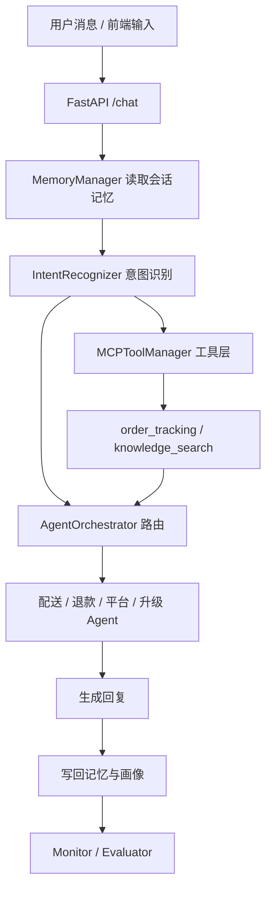

# Echomind_MeiTuan

面向美团外卖客服场景的多智能体服务系统。

本项目基于 EchoMind 的框架思路重构，聚焦外卖客服常见问题的完整闭环：
订单状态、配送进度、骑手联系、商家出餐、退款、取消、少送错送、优惠券、验证码、账号与平台排障。


---

## 核心功能全景

1. **外卖客服意图识别**
   支持订单状态、配送进度、骑手联系、商家延迟、退款、取消、优惠券、验证码、平台报错等意图。
2. **订单查询闭环**
   内置 `order_tracking` 工具，支持按订单号、用户 ID、手机号后四位查询订单状态与异常信息。
3. **知识库检索 (RAG)**
   通过 `knowledge_search` 检索配送 FAQ、退款规则、平台排障知识，并拼接进回复上下文。
4. **技能驱动的客服策略**
   使用 `delivery_service`、`refund_support`、`platform_support` 三类 Skills 约束回复风格与处理流程。
5. **记忆与用户画像**
   支持会话上下文、近期对话压缩、用户画像沉淀，帮助多轮追问与连续查单。
6. **监控与评测**
   提供健康检查、Agent 统计、工具统计、Prometheus 指标与端到端评测接口。
7. **前后端联调工作台**
   配套 Vue 前端，用于查看意图、路由、订单结果、Skills、知识库与评测结果。

---

## 核心设计与模块实现

### 总体流程



### 模块说明

#### 1. 意图识别
- 规则词表 + 语义 embedding + DeepSeek 兜底。
- 输出 `intent`、`intent_group`、`confidence`、`entities`、`urgency`。
- 现有意图覆盖：

```text
order_status, delivery_progress, rider_contact, merchant_delay,
refund, cancel_order, address_change, coupon_rule,
missing_item, wrong_item, complaint,
account_security, login_issue, platform_error,
human_handoff, other
```

#### 2. 路由
- `delivery`：配送、订单、骑手、商家出餐、地址修改。
- `refund`：退款、取消、少送、错送、优惠券。
- `platform`：登录、验证码、App 错误、账号安全。
- `escalation`：投诉与人工升级。

#### 3. MCP 工具层
- `knowledge_search`：知识库检索。
- `order_tracking`：订单查询。
- 当前为内部工具管理层，不是完整外部 MCP 协议。

#### 4. 记忆
- 会话上下文 + 压缩记忆 + 用户画像。
- 优先使用 Redis / ChromaDB，未配置时自动降级为本地内存。

#### 5. Skills
- `delivery_service`
- `refund_support`
- `platform_support`

每个 Skill 都包含：角色定义、核验要求、回复风格、处理流程、禁止事项。

#### 6. 监控与评测
- `GET /health`
- `GET /monitor`
- `GET /metrics`
- `POST /eval/run`

---

## 详细数据流转说明

### 阶段 1：接收请求
- 前端或 HTTP 客户端调用 `POST /chat`。
- 服务读取会话历史和用户画像，构建上下文。

### 阶段 2：识别意图
- 模型和规则并行判断用户诉求。
- 若识别到订单相关问题，则补充实体提取结果。

### 阶段 3：查单与检索
- 订单类问题调用 `order_tracking`。
- 知识类问题调用 `knowledge_search`。

### 阶段 4：Agent 路由
- 按意图归属到对应客服 Agent。
- 必要时升级到 `escalation`。

### 阶段 5：生成回复
- 结合订单结果、知识库与 Skills 输出客服回复。
- 写回记忆与用户画像。

### 阶段 6：监控与评测
- 统计 Agent、工具、知识库使用情况。
- 运行端到端评测集，持续观察整体效果。

---

## 技术栈

| 模块 | 技术 |
|---|---|
| 后端 | FastAPI / Uvicorn |
| 模型接入 | DeepSeek OpenAI-Compatible API |
| 路由与客服编排 | 自定义 AgentOrchestrator |
| 工具层 | MCP 风格内部工具管理 |
| 记忆 | Redis / ChromaDB / 本地内存兜底 |
| 前端 | Vue 3 + Vite |
| 部署 | Docker / Docker Compose |

---

## 项目结构

```text
Echomind_MeiTuan/
├── Echomind_MeiTuan/
│   ├── api/
│   ├── agents/
│   ├── core/
│   ├── data/
│   ├── evaluation/
│   ├── memory/
│   ├── mcp/
│   ├── monitor/
│   ├── skills/
│   ├── requirements.txt
│   └── .env.example
├── Echomind_MeiTuanFrontend/
│   ├── src/
│   ├── docker/
│   ├── package.json
│   └── vite.config.js
└── README.md
```

---

## 快速开始

### 1. 后端启动

```powershell
cd Echomind_MeiTuan
Copy-Item .env.example .env
```

配置 `.env`：

```env
DEEPSEEK_API_KEY=your_deepseek_api_key
DEEPSEEK_BASE_URL=https://api.deepseek.com
DEEPSEEK_MODEL=deepseek-chat
```

启动：

```powershell
python -m pip install -r requirements.txt
python -m uvicorn api.main:app --host 127.0.0.1 --port 8011
```

### 2. 前端启动

```powershell
cd Echomind_MeiTuanFrontend
npm install
npm run dev
```

访问：

```text
http://127.0.0.1:5173
```

---

## API 概览

| 模块 | 方法 | 路由 |
|---|---|---|
| 服务入口 | GET | `/` |
| 健康检查 | GET | `/health` |
| 主对话 | POST | `/chat` |
| Skills | GET/POST | `/skills` / `/skills/reload` |
| 知识库 | POST/GET | `/search` / `/knowledge/*` |
| 监控 | GET | `/monitor` / `/metrics` |
| 评测 | POST | `/eval/run` |

---

## 当前边界

- `order_tracking` 目前使用 mock 数据源，适合演示和联调。
- 退款、取消、赔付仅做客服引导，不执行真实资金动作。
- MCP 当前是内部工具层，不暴露完整外部协议。
- 项目重点是外卖客服 AI 闭环，而不是正式生产订单系统。

---

## 文档入口

- [后端说明](./Echomind_MeiTuan/README.md)
- [前端说明](./Echomind_MeiTuanFrontend/README.md)

